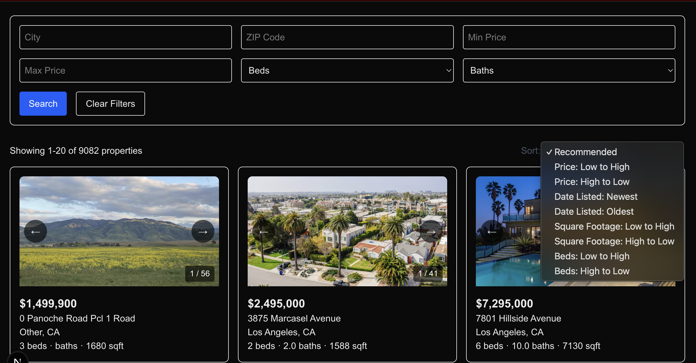

# IDX Exchange Full-Stack Project

A full-stack real-estate listing application built from RETS property data. Users can browse, filter, sort, and paginate property listings, open individual property details, view available open houses, and see property locations on Google Maps.



## Features

- Browse paginated property listings
- Filter by city, ZIP code, price, bedrooms, and bathrooms
- Sort by price, listing date, square footage, or bedrooms
- View property photos in an image carousel
- Open a detailed page for each property
- View scheduled open houses
- Display property locations with Google Maps
- Handle loading, empty, and error states
- Test backend routes and frontend components

## Technology Stack

### Frontend

- Next.js 16.2.12
- React 19.2.4
- React DOM 19.2.4
- Tailwind CSS 4
- React Error Boundary 6.1.3
- Jest 30.4.2
- React Testing Library 16.3.2

### Backend

- Node.js 20.9 or newer
- Express 5.2.1
- MySQL
- mysql2 3.22.5
- CORS 2.8.6
- dotenv 17.4.2
- Jest 30.5.1
- Supertest 7.2.2

Next.js 16 requires Node.js 20.9 or newer. See the [Next.js installation requirements](https://nextjs.org/docs/app/getting-started/installation#system-requirements).

## Project Structure

```text
IDX-Exchange-FullStackProject/
├── backend/
│   ├── config/
│   │   └── db.js
│   ├── routes/
│   │   ├── propertyRoutes.js
│   │   └── propertyRoutes.test.js
│   ├── .env
│   ├── package.json
│   └── server.js
├── frontend/
│   ├── app/
│   │   ├── components/
│   │   ├── property/
│   │   │   └── [id]/
│   │   │       └── page.js
│   │   ├── layout.js
│   │   └── page.js
│   ├── lib/
│   │   ├── api/
│   │   └── utils/
│   ├── public/
│   ├── jest.config.js
│   ├── jest.setup.js
│   ├── next.config.mjs
│   └── package.json
├── package.json
└── README.md
```

## Prerequisites

Install the following before setting up the project:

- Git
- Node.js 20.9 or newer
- npm
- MySQL 8 or a compatible MySQL server
- The RETS SQL dataset used to create `rets_property` and `rets_openhouse`
- A Google Maps Embed API key if map display is required

## Local Setup

### 1. Clone the repository

```bash
git clone https://github.com/coo64362/IDX-Exchange-FullStackProject.git
cd IDX-Exchange-FullStackProject
```

### 2. Install backend dependencies

```bash
cd backend
npm install
```

### 3. Configure the backend environment

Create `backend/.env`:

```env
DB_HOST=localhost
DB_USER=your_mysql_username
DB_PASSWORD=your_mysql_password
DB_NAME=rets
DB_PORT=3306
PORT=5001
```

Do not commit this file because it contains local credentials.

### 4. Prepare the database

Create the database:

```sql
CREATE DATABASE rets;
```

Import the provided RETS SQL data into that database. For a SQL dump, the command will generally look like:

```bash
mysql -u your_mysql_username -p rets < path/to/rets-data.sql
```

Confirm that the required tables exist:

```sql
USE rets;
SHOW TABLES;
```

The results must include:

```text
rets_property
rets_openhouse
```

### 5. Start the backend

From the `backend` directory:

```bash
npm run dev
```

The backend runs at:

```text
http://localhost:5001
```

Verify the connection:

```text
http://localhost:5001/api/health
```

A successful response looks like:

```json
{
  "status": "ok",
  "database": "connected"
}
```

### 6. Install frontend dependencies

Open a second terminal:

```bash
cd frontend
npm install
```

### 7. Configure Google Maps

To display embedded property maps, create `frontend/.env.local`:

```env
NEXT_PUBLIC_GOOGLE_MAPS_API_KEY=your_google_maps_api_key
```

Enable the Maps Embed API for the key. See the [Google Maps Embed API documentation](https://developers.google.com/maps/documentation/embed/get-started).

If no key is supplied, the rest of the application can run, but the map component displays a missing-key message.

### 8. Start the frontend

From the `frontend` directory:

```bash
npm run dev
```

Open:

```text
http://localhost:3000
```

During local development, Next.js forwards `/api/*` requests to the backend at `http://localhost:5001`.

## Application Architecture

```text
Browser
   |
   v
Next.js frontend
   |
   | /api requests
   v
Express backend
   |
   | parameterized SQL queries
   v
MySQL database
```

The frontend contains the listing page, filters, pagination, property cards, property detail page, image components, map, and open-house display.

The frontend API client sends requests using relative `/api` paths. The development rewrite in `frontend/next.config.mjs` forwards those requests to the Express backend.

The Express backend validates query parameters, builds parameterized SQL queries, and retrieves data through a shared mysql2 connection pool. The mysql2 Promise API returns query results as `[rows, fields]`; see the [mysql2 Promise documentation](https://sidorares.github.io/node-mysql2/docs/documentation/promise-wrapper).

## API Reference

The local API base URL is:

```text
http://localhost:5001
```

### `GET /`

Confirms that the backend server is running.

Example response:

```text
Backend server is running
```

### `GET /api/health`

Checks the API and database connection.

Successful response:

```json
{
  "status": "ok",
  "database": "connected"
}
```

Database-error response:

```json
{
  "status": "error",
  "message": "Database connection failed",
  "database": "disconnected"
}
```

### `GET /api/properties`

Returns a filtered, sorted, and paginated collection of properties.

#### Query parameters

| Parameter | Type | Default | Description |
| --- | --- | --- | --- |
| `limit` | Integer | `20` | Results per request; must be between 1 and 100 |
| `offset` | Integer | `0` | Number of matching properties to skip |
| `city` | String | — | Exact city match, ignoring case and surrounding spaces |
| `zipcode` | String | — | Exact ZIP-code match |
| `minPrice` | Number | — | Minimum listing price |
| `maxPrice` | Number | — | Maximum listing price |
| `beds` | Integer | — | Minimum bedrooms |
| `baths` | Number | — | Minimum bathrooms |
| `sortBy` | String | `L_ListingID` | Approved database column used for sorting |
| `sortOrder` | String | `asc` | `asc` or `desc` |

Approved `sortBy` values:

- `L_SystemPrice`
- `ListingContractDate`
- `LM_Int2_3`
- `L_Keyword2`

Example request:

```bash
curl "http://localhost:5001/api/properties?city=Boston&minPrice=300000&beds=3&limit=10&offset=0&sortBy=L_SystemPrice&sortOrder=asc"
```

Example response:

```json
{
  "total": 42,
  "limit": 10,
  "offset": 0,
  "results": [
    {
      "L_ListingID": "TEST-100",
      "L_SystemPrice": 500000,
      "L_Address": "123 Main Street",
      "L_City": "Boston",
      "L_State": "MA",
      "L_Zip": "02110",
      "L_Keyword2": 3,
      "LM_Dec_3": 2,
      "LM_Int2_3": 1500
    }
  ]
}
```

Invalid pagination example:

```json
{
  "error": "The limit must be between 1 and 100, and the offset must be a non-negative integer"
}
```

### `GET /api/properties/:id`

Returns one property by listing ID.

Example request:

```bash
curl "http://localhost:5001/api/properties/TEST-100"
```

Example response:

```json
{
  "L_ListingID": "TEST-100",
  "L_SystemPrice": 500000,
  "L_Address": "123 Main Street",
  "L_City": "Boston",
  "L_State": "MA",
  "L_Zip": "02110",
  "L_Keyword2": 3,
  "LM_Dec_3": 2,
  "LM_Int2_3": 1500
}
```

Unknown-property response:

```json
{
  "message": "Property not found. Please, check the entered ID."
}
```

### `GET /api/properties/:id/openhouses`

Returns scheduled open houses for an existing property.

Example request:

```bash
curl "http://localhost:5001/api/properties/TEST-100/openhouses"
```

Example response:

```json
[
  {
    "id": 25,
    "L_ListingID": "TEST-100",
    "OpenHouseDate": "2026-09-12",
    "OH_StartTime": "13:00:00",
    "OH_EndTime": "15:00:00",
    "all_data": "{\"OpenHouseRemarks\":\"Public open house\"}"
  }
]
```

An existing property with no open houses returns:

```json
[]
```

An unknown property returns:

```json
{
  "error": "Property not found."
}
```

## Database Schema Summary

The imported RETS dataset may contain additional columns. The application currently depends on the following tables and fields.

### `rets_property`

| Column | Purpose |
| --- | --- |
| `L_ListingID` | Property listing identifier used for lookups and relationships |
| `L_SystemPrice` | Listing price |
| `ListingContractDate` | Listing date used for sorting |
| `L_Address` | Street address |
| `L_City` | City |
| `L_State` | State |
| `L_Zip` | ZIP code |
| `L_Keyword1` | Lot-size information |
| `L_Keyword2` | Number of bedrooms |
| `L_Keyword5` | Garage spaces |
| `LM_Dec_3` | Number of bathrooms |
| `LM_Int2_3` | Square footage |
| `L_Photos` | JSON-encoded property-photo collection |
| `L_Remarks` | Property description |
| `L_Class` | Property class |
| `L_Type_` | Property subtype |
| `YearBuilt` | Construction year |
| `LMD_MP_Latitude` | Map latitude |
| `LMD_MP_Longitude` | Map longitude |

### `rets_openhouse`

| Column | Purpose |
| --- | --- |
| `id` | Open-house record identifier when available |
| `L_ListingID` | Associates the open house with a property |
| `OpenHouseDate` | Scheduled date |
| `OH_StartTime` | Start time |
| `OH_EndTime` | End time |
| `all_data` | JSON data containing additional information such as remarks |

### Relationship

```text
rets_property.L_ListingID
            |
            | one property to zero or more open houses
            v
rets_openhouse.L_ListingID
```

## Testing

### Backend tests

```bash
npm --prefix backend test
```

Backend coverage report:

```bash
npm --prefix backend run test:coverage
```

The backend tests use Jest, Supertest, and a mocked database pool. They do not require a live database.

### Frontend tests

```bash
npm --prefix frontend test
```

### Linting

Run both frontend and backend linting from the project root:

```bash
npm run lint
```

## Known Issues

- Local API forwarding is configured specifically for a backend running on port `5001`.
- Property maps require a valid Google Maps Embed API key.
- The RETS dataset is required separately and is not generated by the application.
- Property and open-house fields depend on the structure of the imported RETS data.
- The listing-ID validation currently rejects whitespace and IDs longer than 255 bytes but does not enforce a narrower identifier format.
- Numeric query parsing should be strengthened so values containing trailing invalid characters are rejected consistently.

## Future Improvements

- Make the backend API URL configurable for production deployments.
- Add authentication and administrative listing management.
- Add saved properties and user favorites.
